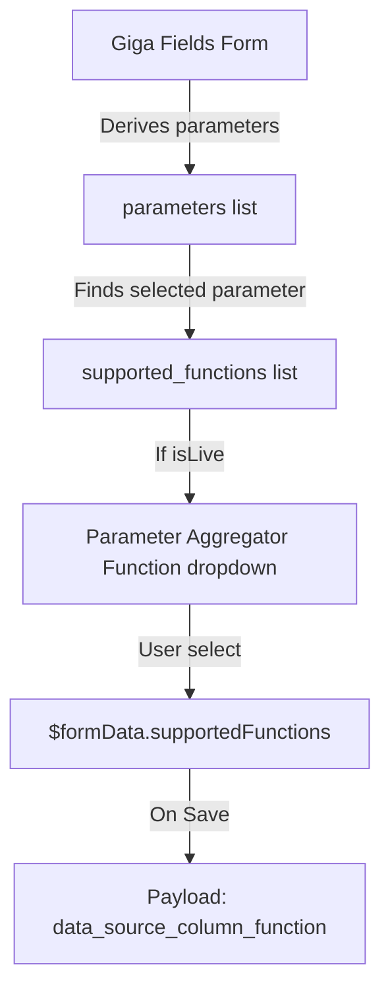

# Giga Maps - Parameter Aggregator Function (layers-avg-function)

This document explains the technical details and implementation of the **Parameter Aggregator Function** feature introduced in the `feature/layers-avg-function` branch.

---

## 1. Feature Overview

The **Parameter Aggregator Function** (also referred to as the Convert or Aggregator Function) allows administrators to specify how raw telemetry data from live sources (e.g., `QOS` or `DAILY_CHECK_APP`) should be aggregated for map visualizations.

Common examples of aggregator functions include:
* **`AVG`**: Computes the average of the parameter values.
* **`SUM`**: Sums the parameter values.

This configuration is applicable only for **Live connectivity layers**.

Dynamic Aggregator Selection: When configuring a Live layer type, the admin form now dynamically renders a "Parameter Aggregator Function" dropdown. The list of options (such as Average or Sum) is populated based on the selected telemetry parameter's metadata configuration.
State & Database Persistence: Form submission payloads now save the selected function configuration object to data_source_column_function in the database, and existing configurations are parsed correctly upon retrieval.
---

## 2. Architecture & Data Flow

When creating or editing a layer in the admin workspace, the flow of the aggregator function config is as follows:

1. **Select Layer Type & API Source**: The user selects **Live connectivity** as the layer type and chooses one or more API data sources.
2. **Select Parameter**: The user selects a specific column parameter (e.g., download speed).
3. **Select Aggregator Function**: If the layer is **Live**, a dropdown field titled **"Parameter Aggregator Function"** is displayed.
   - The choices are dynamically derived from the selected parameter's `supported_functions` configuration array.
4. **Form Submission**: The selected function configuration is sent under the `data_source_column_function` property in the creation/update API payload.
5. **Layer Detail View**: The selected aggregator function is retrieved and displayed on the layer detail screen.



---

## 3. Implementation Details

### 3.1 Type Definitions
Updated in [giga-layer.type.ts](file:///c:/Users/nites/Documents/office/giga-maps-frontend/src/@/admin/types/giga-layer.type.ts):
```typescript
export interface SupportedFunctionType {
  description: string;
  name: string;
  sql: string;
  verbose: string;
}

export interface ColumnConfig {
  // ...
  supported_functions: SupportedFunctionType[];
}

export interface DataLayer {
  // ...
  data_source_column_function: SupportedFunctionType;
}
```

### 3.2 State Management (Effector)
Updated in [giga-layer.model.ts](file:///c:/Users/nites/Documents/office/giga-maps-frontend/src/@/admin/models/giga-layer.model.ts):
* The form state `$formData` now includes `supportedFunctions` (defaults to `null`).
* If the user changes the layer type to anything other than `LIVE`, `supportedFunctions` is reset.
* When editing an existing layer, the model populates `supportedFunctions` from `layer.data_source_column_function`.

### 3.3 Components
* **Fields Form**: In [giga-fields-form.view.tsx](file:///c:/Users/nites/Documents/office/giga-maps-frontend/src/@/admin/ui/giga-layer/common/giga-layer-form/giga-fields-form.view.tsx), the selector renders the supported functions options derived from the parameter:
  ```tsx
  {isLive && <SelectLayerConfig
    name="supportedFunctions"
    required
    labelText="Parameter Aggregator Function"
    value={formData.supportedFunctions?.name}
    onChange={(e) => onUdpateGigaLayerForm([e.target.name, supportedFunctions?.find(item => e.target.value === item.name)])}
  >
    <SelectItem value="" text="Select Parameter Aggregator Function" />
    {supportedFunctions?.map((item) => <SelectItem key={item?.name} value={item?.name} text={`${item?.verbose} ${item.description ? `(${item.description})` : ''}`} />)}
  </SelectLayerConfig>}
  ```
* **Payload Builder**: In [giga-layer-form/index.tsx](file:///c:/Users/nites/Documents/office/giga-maps-frontend/src/@/admin/ui/giga-layer/common/giga-layer-form/index.tsx), the aggregator function is attached to `data_source_column_function` in the API request:
  ```typescript
  data_source_column_function: isLive ? formData.supportedFunctions : null,
  ```
* **View Layer Details**: In [view-giga-layer.view.tsx](file:///c:/Users/nites/Documents/office/giga-maps-frontend/src/@/admin/ui/giga-layer/view-giga-layer.view.tsx), displays the verbose name and description of the selected aggregation function.

---


